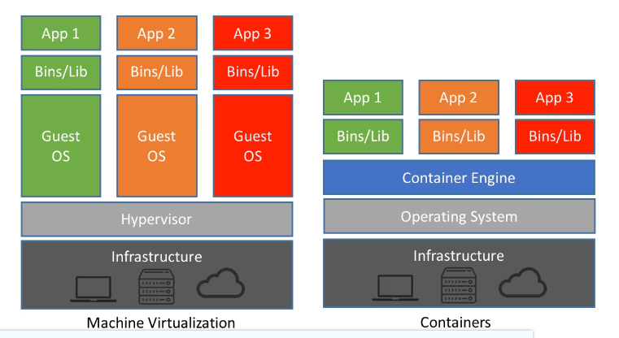
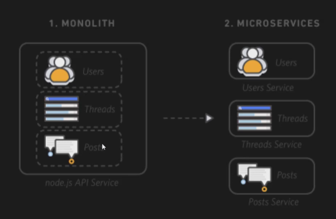
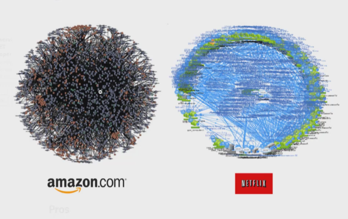

# 0709

# 도커가 왜 필요한지1

- https://www.youtube.com/watch?v=ePpiEy_C_jk&list=PLnIaYcDMsSczk-byS2iCDmQCfVU_KHWDk

- 가상환경을 사용하면 운영팀은 운영이 쉬워진다.
- 그러면 부하가 심해진다.
- 컨테이너는 이 역할을 대신해준다.

- 리눅스 가상화 도구

  - 리눅스 cgroups

  - 리눅스 네임 스페이스

# 도커가 왜 필요한지2

- 기존엔 온프레미스 사용
- 모놀리식 마이크로서비스

- 모놀리식 단점
  - 한꺼번에 업데이트 처리해야함
  - 버그 발생하는경우 한꺼번에 관리
  - 해야하는 일들이 너무 많다.
    - 테스팅 등등
- 마이크로서비스 장점
  - 개발팀이 개별적으로 업데이트 가능
  - 독립적인 서비스 개발 가능

- 사례
  - http://channy.creation.net/blog/1382

- 개별적으로 관리
- 사진은 각 컨테이너들

- 쿠버네티스는 도커를 관리하는 아이

- 우아한 형제들 aws사례
  - https://velog.io/@htchoi1006/AWS-reInvent-2020-%EC%9A%B0%EC%95%84%ED%95%9C%ED%98%95%EC%A0%9C%EB%93%A4%EC%9D%98-%ED%81%B4%EB%9D%BC%EC%9A%B0%EB%93%9C-%EC%97%AC%EC%A0%95

- 대규모 쿠버네티스 구축기 - 라인
  - https://engineering.linecorp.com/ko/blog/building-large-kubernetes-cluster/

# 도커 기초강의1 - 도커소개

https://www.youtube.com/watch?v=uE2MTTTG8uc&list=PLnIaYcDMsSczk-byS2iCDmQCfVU_KHWDk&index=3

## 1 도커와 컨테이너 소개

### 1.1 도커

- 컨테이너 기술을 지원하는 다양한 프로젝트 중에 하나
- 컨테이너 기술은 이전에도 있었으나 도커로 인해 알려짐
- 컨테이너 기술의 사실상 표준
- 2014 가장 인기있는 클라우드 오픈소스 2위(리눅스 재단 발표)
- 다양한 운영체제에서 사용 가능 리눅스, 윈도우, 맥
- 애플리케이션에 국한되지 않고 의존성 및 파일 시스템까지 패키징하여 빌드, 배포, 실행을 단순
- 리눅스의 네임 스페이스와 cgroups와 같은 커널 기능을 사용하여 가상화

