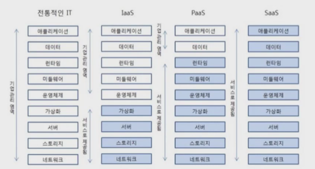
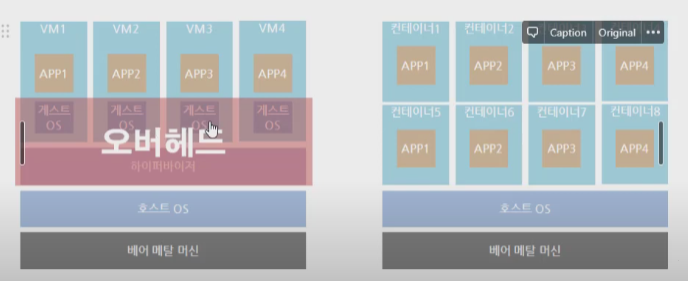
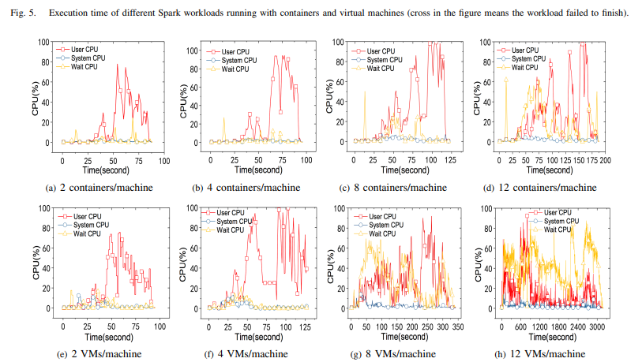
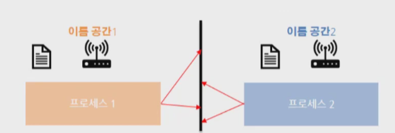
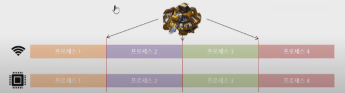

# 0709

# 도커가 왜 필요한지1

- https://www.youtube.com/watch?v=ePpiEy_C_jk&list=PLnIaYcDMsSczk-byS2iCDmQCfVU_KHWDk

- 가상환경을 사용하면 운영팀은 운영이 쉬워진다.
- 그러면 부하가 심해진다.
- 컨테이너는 이 역할을 대신해준다.

- 리눅스 가상화 도구

  - 리눅스 cgroups

  - 리눅스 네임 스페이스

# 도커가 왜 필요한지2

- 기존엔 온프레미스 사용
- 모놀리식 마이크로서비스

- 모놀리식 단점
  - 한꺼번에 업데이트 처리해야함
  - 버그 발생하는경우 한꺼번에 관리
  - 해야하는 일들이 너무 많다.
    - 테스팅 등등
- 마이크로서비스 장점
  - 개발팀이 개별적으로 업데이트 가능
  - 독립적인 서비스 개발 가능

- 사례
  - http://channy.creation.net/blog/1382

- 개별적으로 관리
- 사진은 각 컨테이너들

- 쿠버네티스는 도커를 관리하는 아이

- 우아한 형제들 aws사례
  - https://velog.io/@htchoi1006/AWS-reInvent-2020-%EC%9A%B0%EC%95%84%ED%95%9C%ED%98%95%EC%A0%9C%EB%93%A4%EC%9D%98-%ED%81%B4%EB%9D%BC%EC%9A%B0%EB%93%9C-%EC%97%AC%EC%A0%95

- 대규모 쿠버네티스 구축기 - 라인
  - https://engineering.linecorp.com/ko/blog/building-large-kubernetes-cluster/

# 도커 기초강의1 - 도커소개

https://www.youtube.com/watch?v=uE2MTTTG8uc&list=PLnIaYcDMsSczk-byS2iCDmQCfVU_KHWDk&index=3

## 1 도커와 컨테이너 소개

### 1.1 도커

- 컨테이너 기술을 지원하는 다양한 프로젝트 중에 하나
- 컨테이너 기술은 이전에도 있었으나 도커로 인해 알려짐
- 컨테이너 기술의 사실상 표준
- 2014 가장 인기있는 클라우드 오픈소스 2위(리눅스 재단 발표)
- 다양한 운영체제에서 사용 가능 리눅스, 윈도우, 맥
- 애플리케이션에 국한되지 않고 의존성 및 파일 시스템까지 패키징하여 빌드, 배포, 실행을 단순
- 리눅스의 네임 스페이스와 cgroups와 같은 커널 기능을 사용하여 가상화

도커는 다양한 클라우드 서비스 모델과 같이 사용 가능

- 이미지 : 필요한 프로그램과 라이브러리, 소스를 설치한 뒤 만든 하나의 파일
- 컨테이너 : 이미지를 격리하여 독립된 공간에서 실행한 가상 환경

### 1.2 컨테이너가 해결한다

- 동일 시스템에서 실행하는 소프트웨어의 컴포넌트가 충돌하거나 다양한 종속성을 가지고 있음
  - 서비스 개발중에 자바 파이썬 등등 가져올때
- 컨테이너는 가상머신을 사용해 각 마이크로 서비스를 격리하는 기술
- 컨테이너는 가상머신처럼 하드웨어를 전부 구현하지 않기 때문에 매우 빠른 실행 가능
- 프로세스의 문제가 발생할 경우 컨테이너 전체를 조정해야 하기 때문에 컨테이너에 하나의 프로세스를 실행하도록 하는 것이 좋다 (브라우저와 비슷)

- 하이퍼바이저의 필요 없는 공간을 활용하면 더 많은 자원을 앱에 투자 가능

### 1.3 컨테이너 성능 비교

https://arxiv.org/pdf/1807.01842.pdf

- 도커를 활용하는 경우 훨씬 안정적인 성능을 내고 있다!

### 1.4 컨테이너를 격리하는 기술

- 리눅스 네임스페이스 : 각 프로세스가 제공하는 파일 시스템 마운트, 네트워크, 유저(uid), 호스트 네임(uts)등 에 대해 시스템에 독립 뷰를 제공

- 리눅스 컨트롤 그룹 : 프로세스로 소비할 수 있는 리소스 양 (CPU, 메모리, I/O, 네트워크 대역대, device 노드 등)을 제한

### 1.5 도커의 한계

- 서비스가 커지면 커질 수록 관리해야 하는 컨테이너 양이 급격히증가
- 도커를 사용하여 관리를 하더라도 쉽지 않은 형태
- 배포 및 컨테이너 배치 전략
- 스케일-인, 스케일-아웃이 어려움

### 1.6 도커 기대점

- 원하는 서비스를 백업, 가져오기도 쉬움
- 쉽고 빠르게, 종속성 없이 개발 가능

## 2 도커설치하기

### 2.1 이미지 파일 다운로드

- 실습파일 ubuntu-18.04.2-desktop-amd64.ova 다룬다.

consol/tomcat-7.0